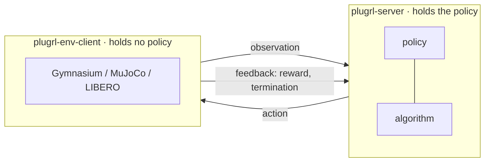

# PlugRL

Reinforcement learning training and the environments it learns from, split into
two processes and joined by a written protocol: WebSocket and msgpack, with a
feedback return channel.

The third arrow is the one that matters. Serving an inference model needs the
first two; learning from what happened needs the third, and the protocol
specifies it rather than leaving it to a convention.

## What has been measured

Every experiment directory carries its data and a `FINDINGS.md` that states
what the result does **not** support.

| | Question | Answer |
|---|---|---|
| [E1](https://github.com/PlugRL/plugrl-server/tree/main/experiments/e1-dependency-conflict) | Do a training stack and an environment stack really conflict? | **No.** The claim this project was built on is disproved |
| [E2](https://github.com/PlugRL/plugrl-server/tree/main/experiments/e2-cross-language) | Can anything but this codebase speak the protocol? | **Yes** - an 843-line C++ client with no third-party libraries |
| [E7](https://github.com/PlugRL/plugrl-server/tree/main/experiments/e7-cross-machine) | What does the boundary cost once packets leave the machine? | **+0.52 ms** on a 184 KiB observation |
| [E10](https://github.com/PlugRL/plugrl-server/tree/main/experiments/e10-vla-forward-cost) | Is that cheap beside a VLA forward pass? | **Yes** - the split is 1.3-3.6% of a step |
| [E11](https://github.com/PlugRL/plugrl-server/tree/main/experiments/e11-vla-rl-libero) | Can a real VLA be trained through it, and does it help? | **Trained, not helped** - below |

## The headline result is negative

A full-size pi0.5 ran end to end through the boundary on LIBERO - inference,
feedback and FPO training - and the server's record of episodes and steps
reconciles exactly with the clients'. As a control, the unmodified checkpoint
scored 99 of 100 on `libero_spatial` and 185 of 200 on `libero_10`, against
openpi's published 98.8 and 92.4.

Then one FPO iteration took the hardest task from **26 of 50 to 0 of 50**, and
the run is incomplete at one iteration of ten: a second learn step does not fit
beside the optimizer state the first one allocates on a 24 GB card. The
predictions were registered before the run, and one of them is falsified.

That is what the data says, so that is what is written down. One experiment
disproved the assumption the project was founded on, and two withdrew earlier
claims of our own.

## Repositories

| | |
|---|---|
| [plugrl-server](https://github.com/PlugRL/plugrl-server) | Training side: policy, algorithm, checkpoints, and the experiments |
| [plugrl-env-client](https://github.com/PlugRL/plugrl-env-client) | Environment side: steps envs, asks for actions, returns feedback |
| [plugrl-protocol](https://github.com/PlugRL/plugrl-protocol) | The specification, its checkable clauses as tests, and two reference env clients |
| [plugrl.github.io](https://github.com/PlugRL/plugrl.github.io) | Documentation, in English and 中文 |

Start at the [documentation](https://plugrl.github.io) - the quickstart trains
FPO on HalfCheetah with no GPU and nothing to download.
